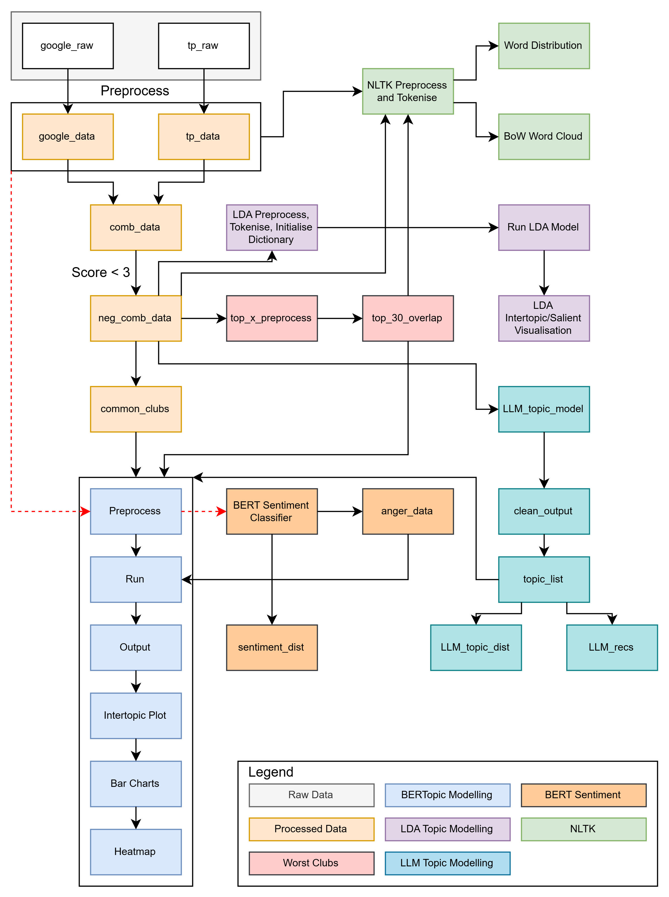

# Customer Experience Optimisation: NLP and Topic Modelling for Gym Reviews

> **Analysing gym customer reviews with NLP and topic modelling to find what drives customer dissatisfaction.**

## ✦ Note
- This project was completed under an NDA. Whilst the company remains anonymous and the code is private, this repository outlines the methodology, architectural approach, and business impact of the work.

## ✦ Overview

- **Problem Statement:** With 500+ locations and reviews scattered across platforms, the business had no efficient way to identify themes driving negative reviews and churn.
- **Objective:** Develop an automated topic modelling pipeline that extracts, clusters, and summarises customer complaints to form actionable recomendations to improve member experience.
- **Impact:** Converts large volumes of unread negative reviews into a short, evidence-based priority list covering operational fixes and reputational risks, enabling leadership to make informed decisions and drive new initiatives.

## ✦ Tech Stack

**Python**, **pandas**, **NLTK**, **BERTopic**, **UMAP**, **Gensim (LDA)**, **pyLDAvis**, **scikit-learn**, **Hugging Face Transformers**, **PyTorch**, **BitsAndBytes (4-bit quantisation)**, **Phi-4-mini-instruct**, **BeautifulSoup**, **WordCloud**, **Matplotlib**, **Seaborn**, **NVIDIA A100 GPU**

## ✦ Data

- **Source(s):** Internal customer review datasets.
- **Size:** 12 months of international Google and Trustpilot customer review data covering over 500 unique locations.
- **Notable Characteristics:** Two independently structured review platforms containing qualitative data in various languages with review volume imbalance per location.

## ✦ Methodology

- **Preprocessing:** Cleaning was matched to model type, with LDA/NLTK methods getting full normalisation (lowercasing, stopword removal, lemmatisation), whilst BERTopic, BERT emotion classification, and the LLM received minimal cleaning to preserve context.
- **Feature Engineering:** Used the LLM to extract the top three topics from each review to run through BERTopic, reducing noise and stylistic variation from the raw text which diluted topic separation.
- **Modelling:**
    - Topic Modelling: BERTopic (transformer embeddings + UMAP) chosen as the primary model for its ability to capture semantic meanings.
    - Emotion Classification: Used a pretrained Hugging Face BERT emotion classifier (bhadresh-savani/bert-base-uncased-emotion) to categorise tone of each review.
    - LLM: 4-Bit Quantised Microsoft Phi-4-mini to extract topics and collate improvement recomendations.
- **Evaluation:** Without a ground truth for review topics, BERTopic results were validated with Gensim's LDA and personal interpretation of each topic cluster, giving confidence that themes show genuine patterns as opposed to model artefacts.

## ✦ Key Results and Outputs

- Isolated key complaint themes from operational issues, such as shower temperature, rude staff, and overcrowding, to an unexpected reputational risk of member disapproval of leadership's political alignment.
- Flagged worst offending locations for priority intervention, discerning quick wins from those which would require substantial investment.
- Pairing LLM review topic extraction with BERTopic produced markedly cleaner and more interpretable clusters.
- Delivered an end-to-end reusable pipeline including NLTK EDA, multiple BERTopic runs, LDA validation, BERT emotion classification, and LLM-generated recomendations, backed by a formal report with five priority improvements for the business.

## ✦ Roadmap and Limitations

- **Limitation:** Non-English reviews contained information which contaminated BERTopic clusters and held insights that could not be extracted. A small local LLM was highly sensitive to prompt wording, with hallucinations identified in some non-deterministic runs.
- **Future Work:** Use a language detection model, such as Meta's FastText, to route through a machine translation model before feeding it into the existing pipeline, and use a more capable LLM via a provider's API through its Python SDK.